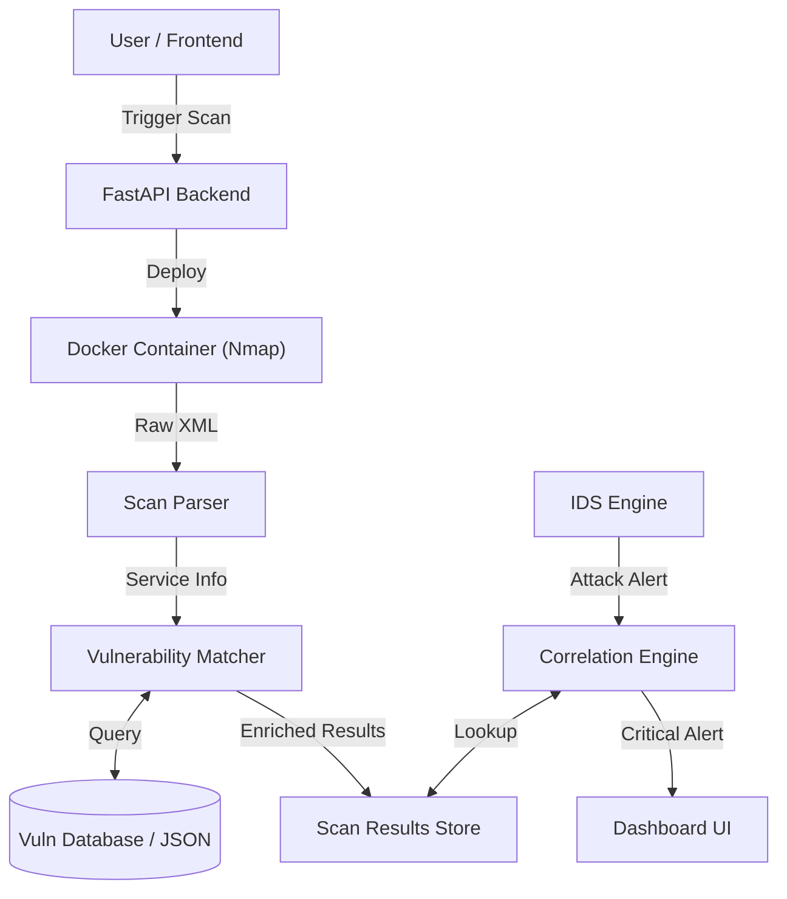

# Aegis Pentesting Module - Technical Documentation

**Version:** 1.0 (Phases 1-3 Complete)
**Date:** 2026-02-01

## 1. Module Overview
The Aegis Pentesting Module is a lightweight, local network security scanner integrated directly into the Aegis IDS. It allows users to scan local assets for open ports and known vulnerabilities (CVEs) without relying on external cloud scanners.

**Key Capabilities:**
*   **Active Scanning:** Uses Nmap (via Docker) to discover hosts and services.
*   **Vulnerability Intelligence:** Matches discovered services against the CISA Known Exploited Vulnerabilities (KEV) catalog and NVD data.
*   **Smart Correlation:** Cross-references active IDS attacks with knowledge of vulnerable assets to prioritize "Critical" threats.

---

## 2. System Architecture

### 2.1 Component Diagram

### 2.2 Tech Stack
*   **Engine:** `python-nmap` wrapped in a secure `alpine`-based Docker container.
*   **Backend:** Python 3.10+, FastAPI.
*   **Database:** Local JSON-based store (for MVP), extensible to SQLite/PostgreSQL.
*   **Frontend:** React (Vite), with real-time feedback and risk visualization.

---

## 3. Core Components

### 3.1 Scanner Engine (`backend/pentest/scanner_engine.py`)
Encapsulates the complexity of running Nmap securely.
*   **Isolation:** Runs all scans inside a Docker container (`instrumentisto/nmap`) to prevent pollution of the host OS and ensure consistent Nmap versions.
*   **Modes:**
    *   `Quick`: Top 100 ports, fast timing (`-T4`).
    *   `Full`: All 65535 ports, service detection (`-sV`).
    *   `Stealth`: Slower timing (`-T2`), no ping (`-Pn`).

### 3.2 Vulnerability Matcher (`backend/pentest/matcher.py`)
The "brain" of the scanner. It takes raw service banners (e.g., "Apache httpd 2.4.49") and finds associated CVEs.
*   **Fuzzy Matching:** Handles vendor/product discrepancies (e.g., matching "Apache" to "Apache Software Foundation").
*   **CPE Generation:** Dynamically generates Common Platform Enumeration (CPE) strings to query the vulnerability database.
*   **Intelligence Feeds:**
    *   **CISA KEV:** Prioritizes vulnerabilities known to be exploited in the wild (Red "Exploited" Badge).
    *   **NVD:** Provides standard CVSS scores and descriptions.

### 3.3 Correlation Engine (`backend/ids/engine/correlation.py`)
**Phase 3 Innovation.** This component bridges the gap between *Passive Monitoring* (IDS) and *Active Knowledge* (Pentest).
*   **Workflow:**
    1.  IDS detects an attack (e.g., "SYN Flood" against `192.168.1.50`).
    2.  Engine checks: "Do we have a scan for `192.168.1.50`?"
    3.  If yes, "Is port 80 open and vulnerable?"
    4.  If yes, **Escalate Severity** to `CRITICAL` and attach `correlation_context` to the alert.
*   **Result:** Reduces alert fatigue by highlighting threats that can actually succeed.

---

## 4. Data Flow & APIs

### 4.1 Vulnerability Data Pipeline
Data is ingested from external sources and stored locally to ensure offline capability.
*   **Source:** `backend/vuln_data/sources/cisa.py` pulls from `cisa.gov`.
*   **Storage:** `backend/vuln_data/db/vulnerabilities.json`.
*   **Update Mechanism:** `backend/vuln_data/manager.py` (runs on startup/demand).

### 4.2 Key Endpoints
| Method | Endpoint | Description |
| :--- | :--- | :--- |
| `POST` | `/api/pentest/scan` | Trigger a new scan (Async background task). |
| `GET` | `/api/pentest/results/{id}` | Get detailed results including CVEs. |
| `GET` | `/api/pentest/history` | List previous scans. |
| `GET` | `/api/detection/live` | Stream IDS alerts (Enriched by Correlation Engine). |

---

## 5. Security & Safety Mechanisms
*   **Input Sanitization:** Target inputs are validated to prevent command injection.
*   **Docker Isolation:** Scans cannot access the host filesystem.
*   **Local-Only Binding:** Docker scanning uses specific network bindings (`host.docker.internal` for Windows compatibility) to ensure it only scans what the user intends.

## 6. Future Roadmap
*   **Phase 4:** Dynamic Firewall Policies (Block IPs attacking vulnerable ports).
*   **Phase 5:** LLM Advisor (Explain *why* a vulnerability is dangerous).
